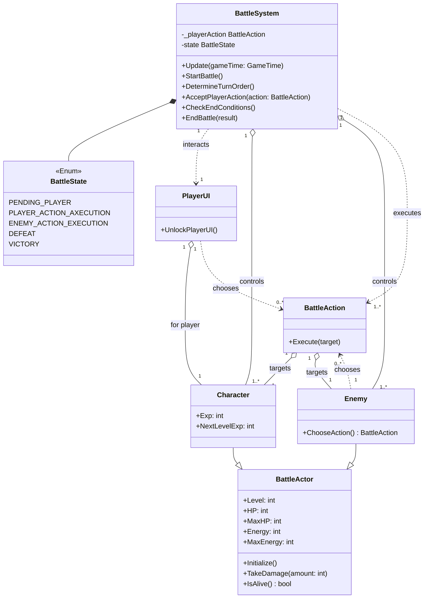
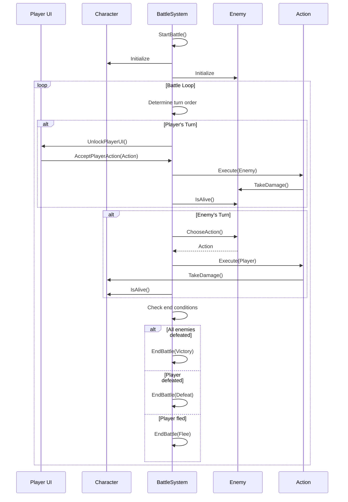

# Battle System Design Document

## Class Diagram

```mermaid
classDiagram
    class BattleSystem {
        -_playerAction BattleAction
        -state BattleState
        
        +Update(gameTime: GameTime)
        +StartBattle()
        +DetermineTurnOrder()
        +AcceptPlayerAction(action: BattleAction)
        +CheckEndConditions()
        +EndBattle(result)
    }
    class BattleState {
        <<Enum>>
        PENDING_PLAYER
        PLAYER_ACTION_AXECUTION
        ENEMY_ACTION_EXECUTION
        DEFEAT
        VICTORY
    }
    class BattleActor {
        +Level: int
        +HP: int
        +MaxHP: int
        +Energy: int
        +MaxEnergy: int
        +Initialize()
        +TakeDamage(amount: int)
        +IsAlive() bool
    }
    
    class Character {
        +Exp: int
        +NextLevelExp: int
    }
    class Enemy {
        +ChooseAction() BattleAction
    }
    class PlayerUI {
        +UnlockPlayerUI()
    }
    class BattleAction {
        +Execute(target)
    }
    
    Character --|> BattleActor
    Enemy --|> BattleActor
    BattleSystem *-- BattleState
    BattleSystem "1" ..> "1" PlayerUI : interacts
    BattleSystem "1" o-- "1..*" Character : controls
    BattleSystem "1" o-- "1..*" Enemy : controls
    BattleSystem "1" ..> "1..*" BattleAction : executes
    PlayerUI "1" o-- "1" Character : for player
    Enemy "1" ..> "0..*" BattleAction : chooses
    PlayerUI "1" ..> "0..*" BattleAction : chooses
    BattleAction "1" o-- "1" Character : targets
    BattleAction "1" o-- "1" Enemy : targets

```

## Process

```mermaid
sequenceDiagram
    participant UI as Player UI
    participant P as Character
    participant BS as BattleSystem
    participant E as Enemy
    participant A as Action

    BS->>BS: StartBattle()
    BS->>P: Initialize
    BS->>E: Initialize
    
    loop Battle Loop
        BS->>BS: Determine turn order
        
        alt Player's Turn
            BS->>UI: UnlockPlayerUI()
            UI->>BS: AcceptPlayerAction(Action)
            BS->>A: Execute(Enemy)
            A->>E: TakeDamage()
            BS->>E: IsAlive()
        end
        
        alt Enemy's Turn
            BS->>E: ChooseAction()
            E-->>BS: Action
            BS->>A: Execute(Player)
            A->>P: TakeDamage()
            BS->>P: IsAlive()
        end
        
        BS->>BS: Check end conditions
        
        alt All enemies defeated
            BS->>BS: EndBattle(Victory)
        else Player defeated
            BS->>BS: EndBattle(Defeat)
        else Player fled
            BS->>BS: EndBattle(Flee)
        end
    end

```