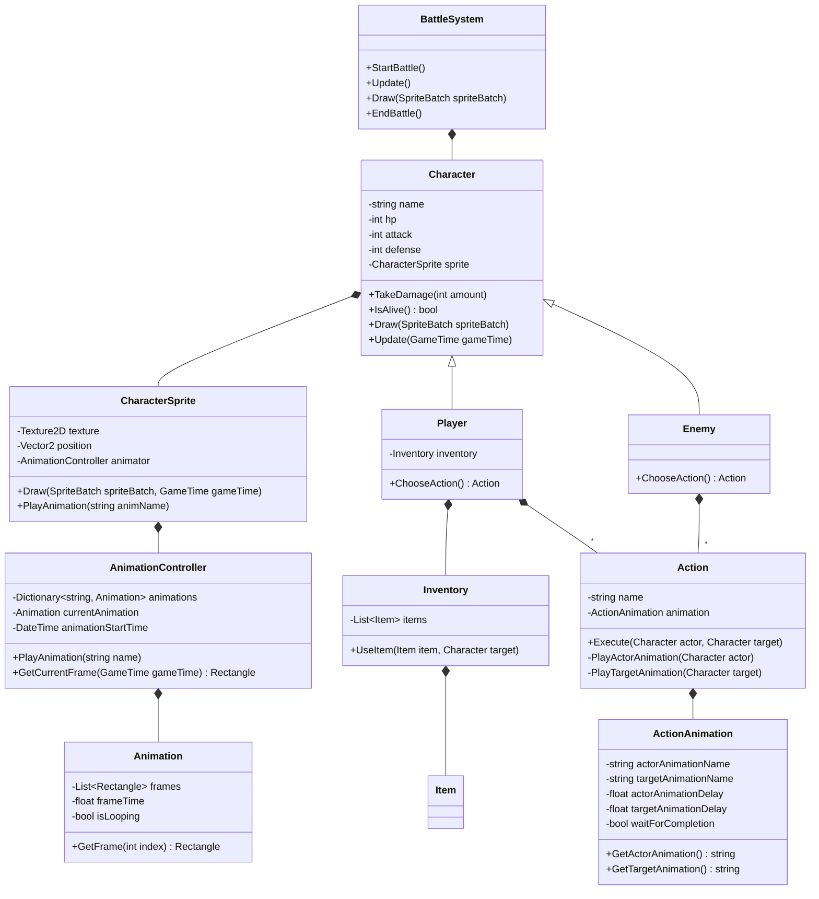
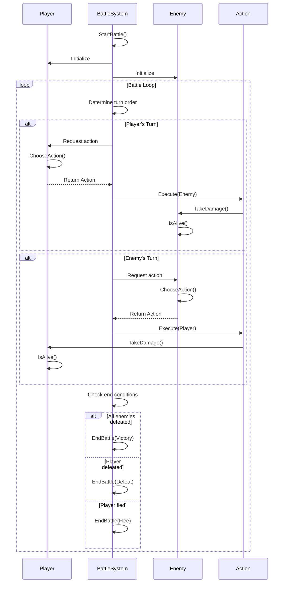

# Battle System Design Document

## Overview

A turn-based battle system for a JRPG game built with MonoGame. Players and enemies take alternating turns to perform actions: attack, use items, defend, or flee.

## Main Entities

- **Player** — the player's character participating in battle
- **Enemy** — opponent controlled by AI
- **BattleSystem** — controls battle flow, turn order, and action processing
- **Action** — abstraction for actions (attack, defend, item usage)
- **Inventory** — stores items that can be used in battle

## Battle Flow

1. Battle initialization (create participants, set initial parameters)
2. Determine turn order
3. Player selects an action
4. Enemy selects an action (AI)
5. Execute actions in order
6. Check battle end conditions (victory, defeat, flee)
7. End battle, distribute rewards

## Class Diagram

## Process

## Available Actions

- Attack: deals damage to enemy
- Defend: reduces incoming damage
- Use Item: applies item effect from inventory
- Flee: attempt to escape from battle

## Victory/Defeat Conditions

- Victory: all enemies defeated
- Defeat: player HP reaches zero
- Flee: successful escape attempt

## Future Enhancements

- Multi-enemy battles
- Status effects (poison, stun)
- Special abilities and magic
- More complex AI behavior