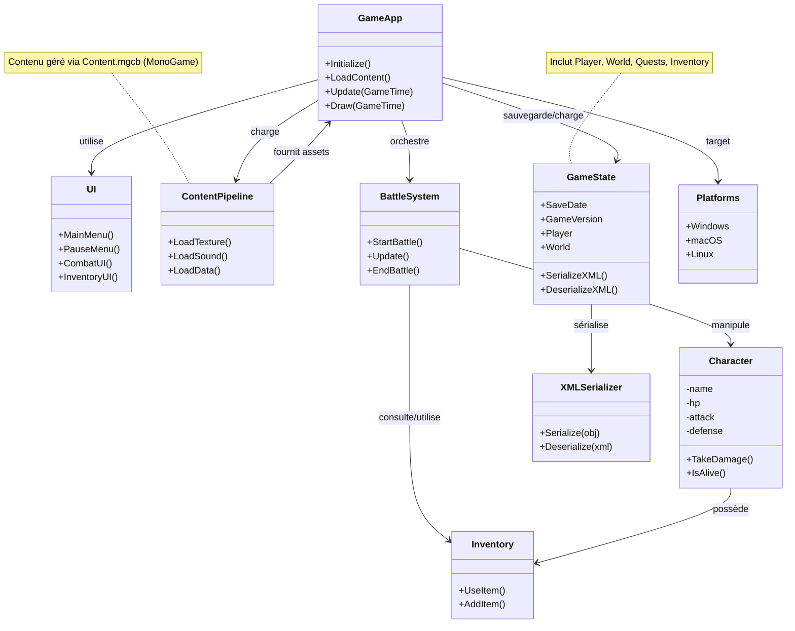

# Fiche signalétique — EchoReborn (version 0.1)

> Fiche d'identité du projet — première version.

## Informations générales

- Titre (provisoire) : EchoReborn
- Genre : JRPG / RPG au tour par tour
- Support cible : Desktop — Windows, macOS, Linux (multi-plateforme). MonoGame permet de viser ces plateformes.
- Technologie : C#, MonoGame, .NET 8.0
- Dépôt / projet : projet Visual Studio (.csproj) — nom de la solution : `EchoReborn.sln`

## Courte description

EchoReborn est un RPG au tour par tour construit avec MonoGame. Le joueur contrôle un ou plusieurs personnages, progresse dans un monde composé de quelques lieux, affronte des ennemis en combats au tour par tour, gère un inventaire et sauvegarde sa progression.

## Sujet / Pitch

Le protagoniste a été fragmenté : il part à la recherche de ses parties du corps dispersées à travers le monde. Dans chaque lieu se trouve un boss qui détient une partie manquante ; en le battant il récupère cette partie et obtient une compétence spéciale liée à celle-ci. Le récit et la progression sont centrés sur cette quête de réunification corporelle et sur la manière dont chaque partie récupérée modifie les capacités du personnage.

## Personnage principal

- Nom : (à définir)
- Description : personnage central fragmenté (physiquement et symboliquement). Chaque partie récupérée représente un palier de puissance et une nouvelle mécanique jouable.
- Mécanique clé : récupérer une partie du corps confère une compétence spéciale (ex. bras = attaque spéciale, jambe = dash / vitesse, œil = précision / portée, cœur = régénération / bonus passif).

## Style visuel

- Direction artistique (MVP) : pixel art / sprites image par image (frame-by-frame) adaptés pour des animations 2D simples. Le style privilégiera la lisibilité des actions (attaques, compétences, états) plutôt que le détail photoréaliste.
- Source recommandée : sprites gratuits CraftPix (Freebies) — https://craftpix.net/freebies/filter/sprites/ — utiliser ces packs comme ressources pour prototypage et placeholders.
- Lien principal CraftPix : https://craftpix.net/freebies/filter/sprites/
- Format recommandé : PNG, fonds transparents (alpha), tailles cohérentes (par ex. 32x32, 48x48 ou 64x64 par frame selon l'échelle de la caméra). Privilégier un multiple d'une grille (ex. 32 px) pour faciliter le placement et collisions.
- Animation : séquences image par image (idle, walk, attack, hurt, death). Importer chaque animation comme une série de fichiers nommés séquentiellement ou comme spritesheet (conserver convention de nommage).
- Licence : vérifier la licence de chaque asset CraftPix avant utilisation et mentionner les crédits si nécessaire (certaines ressources requièrent attribution).

### Packs supplémentaires (liens + aperçu)

- Free RPG Monster Sprites Pixel Art (CraftPix)
  - Lien : https://craftpix.net/freebies/free-rpg-monster-sprites-pixel-art/
  - Aperçu :

  
- Free Satyr Sprite Sheet (CraftPix)
  - Lien : https://craftpix.net/freebies/free-satyr-sprite-sheet-pixel-art-pack/
  - Aperçu :

  

- Free Fantasy Enemies Pixel Art Sprite Pack (CraftPix)
  - Lien : https://craftpix.net/freebies/free-fantasy-enemies-pixel-art-sprite-pack/
  - Aperçu :

  

- Free Wizard Sprite Sheets (CraftPix)
  - Lien : https://craftpix.net/freebies/free-wizard-sprite-sheets-pixel-art/
  - Aperçu :

  

## Objectifs MVP (extrait et synthèse)

Fonctionnalités minimales à livrer pour une version jouable :

- Gestion des personnages : création / personnalisation basique, statistiques (PV, PM, Attaque, Défense, Vitesse), progression (niveaux, expérience), inventaire.
- Système de combat : combats au tour par tour, actions de base (Attaquer, Défendre, Utiliser objet, Fuir), compétences/compétences simples, calculs de dégâts/soins, conditions victoire/défaite.
- Monde et progression : 2–3 lieux, 3–5 types d'ennemis, transitions entre lieux, points de sauvegarde.
- UI minimale : menu principal, menu pause, interface de combat, menu inventaire, affichage des statistiques.
- Contenu : 5–10 objets (potions, armes), histoire basique (début + fin simple).
- Mécanique de progression liée au pitch : dans chaque location un boss principal détient une partie du corps de la protagoniste ; la victoire donne la partie récupérée et débloque une compétence spéciale associée.
- Assets graphiques (MVP) : utilisation de sprites gratuits image par image (frame-by-frame) provenant de CraftPix — https://craftpix.net/freebies/filter/sprites/ — à utiliser comme ressources/placeholder pour le prototype (prévoir vérification de la licence d'utilisation pour le contexte pédagogique).

(Source : `docs/README.md`)

## Système de combat (points saillants)

- Tour par tour avec alternance joueur / IA.
- Actions disponibles : Attaque, Défendre, Utiliser objet, Fuir.
- Tour : détermination de l'ordre, sélection d'action, exécution, vérification des conditions de fin (victoire, défaite, fuite), distribution des récompenses.
- Architecture suggérée : `BattleSystem`, `Character` (Player/Enemy), `Action`, `Inventory`, `ActionAnimation`, `AnimationController`.

(Source : `docs/Battle.md`)

## Persistance / sauvegarde

- Format de sauvegarde attendu : XML (spécifié dans la doc).
- Entités principales sauvegardées : GameState (date, version, temps de jeu), Player (stats, position, inventaire, skills), World (locations, NPCs, objets), Quests, InventoryItem, Skills.
- Conventions : GUID pour identifiants, DateTime ISO 8601, TimeSpan en format ISO 8601, coordonnées en float, dispositions d'NPC -100..100.

(Source : `docs/Persistent.md`)

## Structure technique & contraintes observées

- Projet .NET 8.0 (répertoires `bin/Debug/net8.0`, `obj/.../net8.0`).
- Usage attendu de MonoGame (moteur graphique 2D/3D léger ciblant C#).
- Pipeline de contenu présent (`Content/`, `Content.mgcb`).
- Implications multi-plateforme : prévoir validation des builds sur macOS et Linux, gestion des différences d'input/chemins de fichiers et packaging (exécutables, bundles, permissions). Mettre en place des procédures de test et, si possible, une CI multi-plateforme.
- Ressources graphiques : les textures et animations du MVP seront basées sur des sprites frame-by-frame gratuits (CraftPix Freebies). Vérifier les conditions de licence et crédit éventuel avant distribution.

