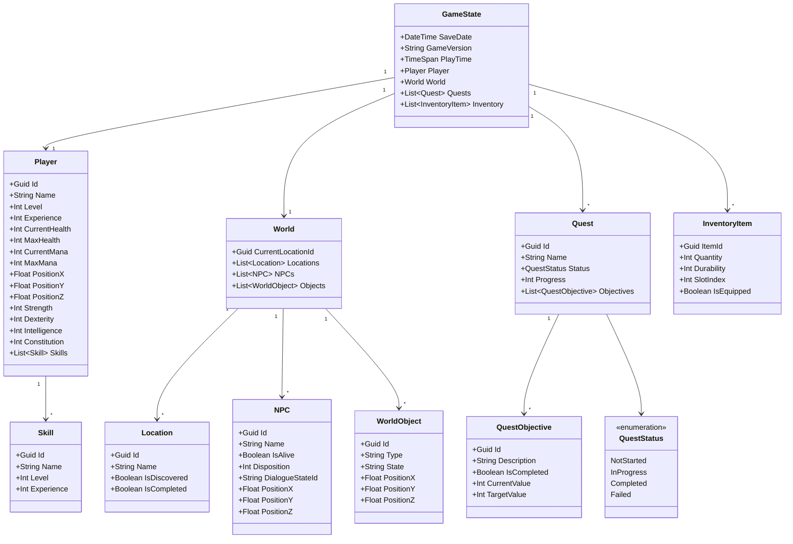

# Game State Persistence

This document describes the entities required to store and restore the game's state using XML format.

## Entity Overview

The game state is composed of several interconnected entities that capture all necessary information to save and load the game:

1. **GameState** - Root entity containing all game data
2. **Player** - Player character information and stats
3. **World** - World state including locations and objects
4. **Quest** - Quest progress and objectives
5. **InventoryItem** - Items in player inventory
6. **NPC** - Non-player character states
7. **Location** - Location information and status
8. **WorldObject** - Interactive objects in the world
9. **Skill** - Player skills and abilities
10. **QuestObjective** - Individual quest objectives

## Entity Definitions

### GameState (Root)
- **SaveDate**: DateTime - Timestamp when the game was saved
- **GameVersion**: String - Version of the game
- **PlayTime**: TimeSpan - Total play time
- **Player**: Player - Player character data
- **World**: World - World state data
- **Quests**: List<Quest> - All quests
- **Inventory**: List<InventoryItem> - Player inventory

### Player
- **Id**: Guid - Unique player identifier
- **Name**: String - Character name
- **Level**: Integer - Current level
- **Experience**: Integer - Experience points
- **CurrentHealth**: Integer - Current health points
- **MaxHealth**: Integer - Maximum health points
- **CurrentMana**: Integer - Current mana points
- **MaxMana**: Integer - Maximum mana points
- **PositionX**: Float - X coordinate
- **PositionY**: Float - Y coordinate
- **PositionZ**: Float - Z coordinate
- **Strength**: Integer - Strength attribute
- **Dexterity**: Integer - Dexterity attribute
- **Intelligence**: Integer - Intelligence attribute
- **Constitution**: Integer - Constitution attribute
- **Skills**: List<Skill> - Learned skills

### World
- **CurrentLocationId**: Guid - Current location identifier
- **Locations**: List<Location> - All locations and their states
- **NPCs**: List<NPC> - All NPCs and their states
- **Objects**: List<WorldObject> - Interactive objects

### Location
- **Id**: Guid - Unique location identifier
- **Name**: String - Location name
- **IsDiscovered**: Boolean - Whether player has discovered this location
- **IsCompleted**: Boolean - Whether location objectives are completed

### NPC
- **Id**: Guid - Unique NPC identifier
- **Name**: String - NPC name
- **IsAlive**: Boolean - Whether NPC is alive
- **Disposition**: Integer - Attitude toward player (-100 to 100)
- **DialogueStateId**: String - Current dialogue state identifier
- **PositionX**: Float - X coordinate
- **PositionY**: Float - Y coordinate
- **PositionZ**: Float - Z coordinate

### WorldObject
- **Id**: Guid - Unique object identifier
- **Type**: String - Object type (door, chest, lever, etc.)
- **State**: String - Current state (opened, closed, locked, etc.)
- **PositionX**: Float - X coordinate
- **PositionY**: Float - Y coordinate
- **PositionZ**: Float - Z coordinate

### Quest
- **Id**: Guid - Unique quest identifier
- **Name**: String - Quest name
- **Status**: Enum - NotStarted, InProgress, Completed, Failed
- **Progress**: Integer - Progress percentage (0-100)
- **Objectives**: List<QuestObjective> - Quest objectives

### QuestObjective
- **Id**: Guid - Unique objective identifier
- **Description**: String - Objective description
- **IsCompleted**: Boolean - Whether objective is completed
- **CurrentValue**: Integer - Current progress value
- **TargetValue**: Integer - Target progress value

### InventoryItem
- **ItemId**: Guid - Item type identifier
- **Quantity**: Integer - Number of items
- **Durability**: Integer - Item durability (0-100, optional)
- **SlotIndex**: Integer - Inventory slot position
- **IsEquipped**: Boolean - Whether item is equipped

### Skill
- **Id**: Guid - Unique skill identifier
- **Name**: String - Skill name
- **Level**: Integer - Skill level
- **Experience**: Integer - Skill experience points

## Class Diagram

## Notes

- All Guid fields should use standard GUID format
- DateTime fields use ISO 8601 format
- TimeSpan uses ISO 8601 duration format (PT5H30M = 5 hours 30 minutes)
- Position coordinates use Float for precise positioning
- Disposition values range from -100 (hostile) to 100 (friendly)
- Progress and durability values range from 0 to 100
