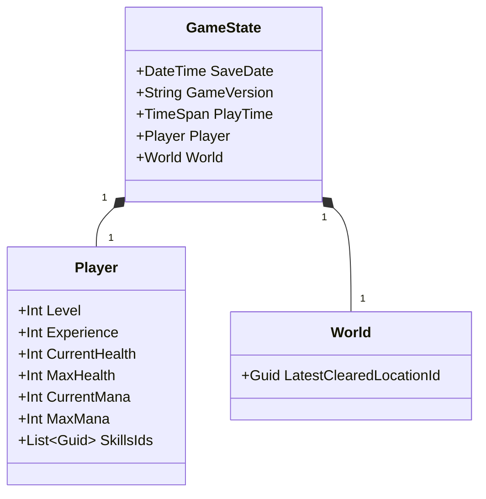

# Game State Persistence

This document describes the entities required to store and restore the game's state using XML format.

## Entity Overview

The game state is composed of three main entities that capture all necessary information to save and load the game:

1. **GameState** - Root entity containing all game data
2. **Player** - Player character information and stats
3. **World** - World state including locations and objects

## Entity Definitions

### GameState (Root)
- **SaveDate**: DateTime - Timestamp when the game was saved
- **GameVersion**: String - Version of the game
- **PlayTime**: TimeSpan - Total play time
- **Player**: Player - Player character data
- **World**: World - World state data

### Player
- **Level**: Integer - Current level
- **Experience**: Integer - Experience points
- **CurrentHealth**: Integer - Current health points
- **MaxHealth**: Integer - Maximum health points
- **CurrentMana**: Integer - Current mana points
- **MaxMana**: Integer - Maximum mana points
- **SkillsIds**: List<Guid> - List of skill identifiers

### World
- **LatestClearedLocationId**: Guid - ID of the latest cleared location

## Class Diagram

## Notes

- All Guid fields should use standard GUID format
- DateTime fields use ISO 8601 format
- TimeSpan uses ISO 8601 duration format (PT5H30M = 5 hours 30 minutes)
