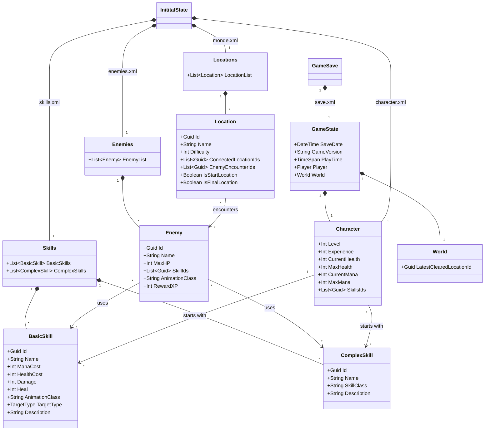

# Predefined Game Data

This document describes the XML structure for all predefined game content that defines skills, locations, enemies, and other static game data.

## Overview

The game uses XML files to define:
1. **Skills** - Player abilities including damage, healing, and complex mechanics
2. **Locations** - Map nodes and their connections
3. **Enemies** - Enemy types with their stats and skills
4. **Character** - Player character base stats

## XML Document Structures

### Skills.xml

Contains all player skills including basic damage/heal abilities and complex mechanic skills.

#### Basic Skills (Damage/Heal)
Basic skills contain all necessary data within the XML:
- **Id**: Guid - Unique skill identifier
- **Name**: String - Display name
- **ManaCost**: Integer - Mana required to use
- **HealthCost**: Integer - Health cost to use the skill
- **Damage**: Integer - Damage amount (for damage skills)
- **Heal**: Integer - Heal amount (for healing skills)
- **AnimationClass**: String - Full C# class name for animation (e.g., "EchoReborn.Animations.AttackAnimation")
- **TargetType**: Enum - Self, SingleEnemy, AllEnemies, SingleAlly, AllAllies
- **Description**: String - Skill description for UI

#### Complex Skills (Passives/Special Mechanics)
Complex skills reference C# classes for implementation:
- **Id**: Guid - Unique skill identifier
- **Name**: String - Display name
- **SkillClass**: String - Full C# class name implementing the skill logic (e.g., "EchoReborn.Skills.MegaAttackSkill")
- **Description**: String - Skill description for UI

### Locations.xml

Defines the map structure and location connections.

- **Id**: Guid - Unique location identifier
- **Name**: String - Location display name
- **Difficulty**: Integer - Relative difficulty level
- **ConnectedLocationIds**: List<Guid> - IDs of connected locations
- **EnemyEncounterIds**: List<Guid> - Possible enemy encounters at this location
- **IsStartLocation**: Boolean - Whether this is the starting location
- **IsEndLocation**: Boolean - Whether this is the final location

### Enemies.xml

Defines enemy types and their combat capabilities.

- **Id**: Guid - Unique enemy identifier
- **Name**: String - Enemy display name
- **MaxHP**: Integer - Maximum health points
- **SkillIds**: List<Guid> - References to skills from Skills.xml
- **AnimationClass**: String - Full C# class name for enemy animations
- **RewardXP**: Integer - Experience points awarded on defeat

### Character.xml

Defines the player character's base stats and starting configuration.

- **BaseMaxHP**: Integer - Starting maximum health
- **BaseMaxMana**: Integer - Starting maximum mana
- **BaseMaxXP**: Integer - XP required for first level up
- **StartingSkillIds**: List<Guid> - References to starting skills from Skills.xml

## Class Diagram



## Enumerations

### TargetType
- **Self** - Targets only the user
- **SingleEnemy** - Targets one enemy
- **AllEnemies** - Targets all enemies
- **SingleAlly** - Targets one ally
- **AllAllies** - Targets all allies

## Example XML Snippets

### Basic Damage Skill
```xml
<BasicSkill>
  <Id>a1b2c3d4-e5f6-7890-abcd-ef1234567890</Id>
  <Name>Attack</Name>
  <ManaCost>0</ManaCost>
  <HealthCost>0</HealthCost>
  <Damage>30</Damage>
  <Heal>0</Heal>
  <AnimationClass>EchoReborn.Animations.WandererMagician.AttackAnimation</AnimationClass>
  <TargetType>SingleEnemy</TargetType>
  <Description>Basic attack dealing 30 damage</Description>
</BasicSkill>
```

### Complex Skill with Custom Logic
```xml
<ComplexSkill>
  <Id>b2c3d4e5-f6g7-8901-bcde-f12345678901</Id>
  <Name>Mega Attack</Name>
  <SkillClass>EchoReborn.Skills.MegaAttackSkill</SkillClass>
  <Description>Mega attack with special mechanics</Description>
</ComplexSkill>
```

### Location
```xml
<Location>
  <Id>c3d4e5f6-g7h8-9012-cdef-123456789012</Id>
  <Name>Location 1 Name</Name>
  <Difficulty>1</Difficulty>
  <ConnectedLocationIds>
    <Guid>d4e5f6g7-h8i9-0123-defg-234567890123</Guid>
  </ConnectedLocationIds>
  <EnemyEncounterIds>
    <Guid>e5f6g7h8-i9j0-1234-efgh-345678901234</Guid>
  </EnemyEncounterIds>
  <IsStartLocation>true</IsStartLocation>
  <IsEndLocation>false</IsEndLocation>
</Location>
```

### Enemy
```xml
<Enemy>
  <Id>e5f6g7h8-i9j0-1234-efgh-345678901234</Id>
  <Name>Enemy</Name>
  <MaxHP>100</MaxHP>
  <SkillIds>
    <Guid>a1b2c3d4-e5f6-7890-abcd-ef1234567890</Guid>
  </SkillIds>
  <AnimationClass>EchoReborn.Animations.BasicEnemyAnimation</AnimationClass>
  <RewardXP>50</RewardXP>
</Enemy>
```

## Notes

- All XML files should be stored in the `Content/Data/` directory
- XML deserialization will be handled by C# XmlSerializer
- AnimationClass and SkillClass must reference fully qualified class names
- Complex skills must implement the `ISkill` interface in their C# implementation
- All Guid values must be unique across the entire game
- Resource references (SkillIds, ConnectedLocationIds, etc.) must match existing entity IDs

