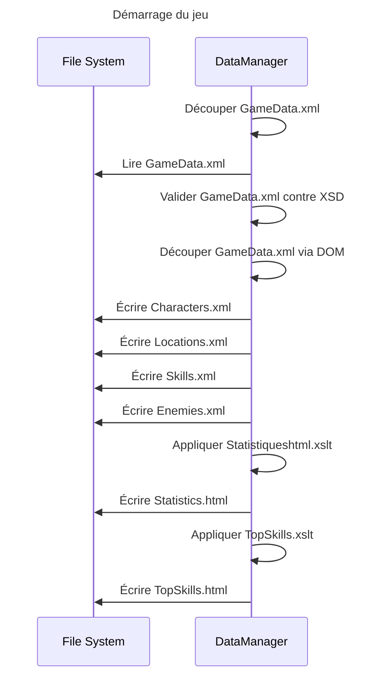
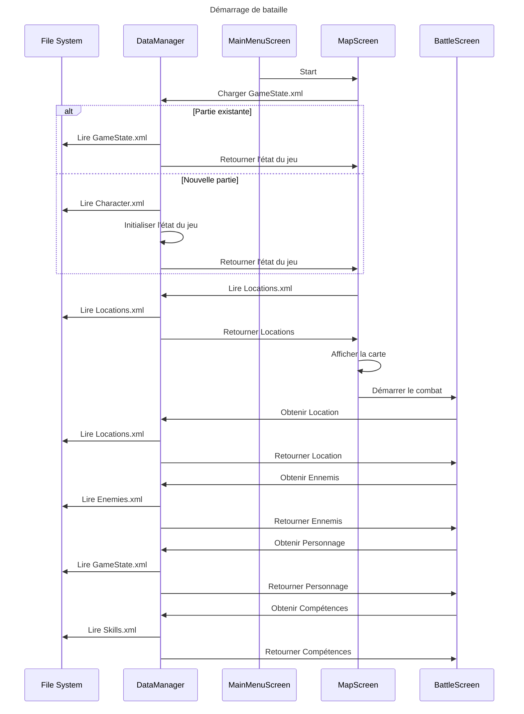
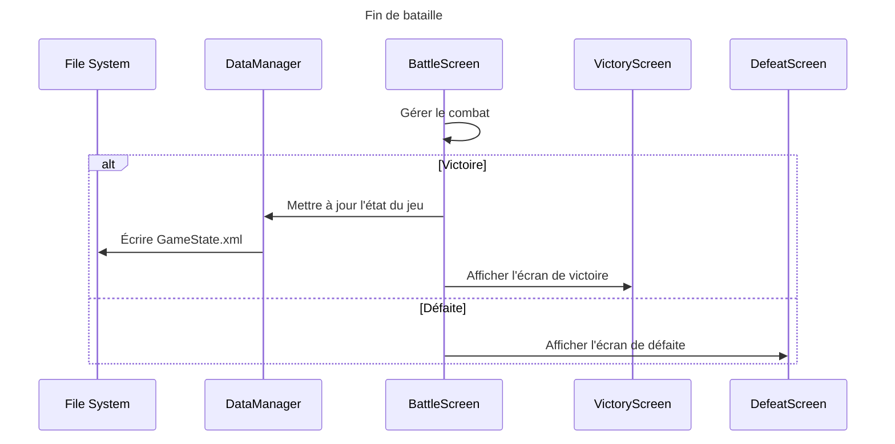

# XML Utilisation

```mermaid
sequenceDiagram
    title Démarrage du jeu
    participant FS as File System
    participant DM as DataManager

    DM->>DM: Découper GameData.xml
    DM->>FS: Lire GameData.xml
    DM->>DM: Valider GameData.xml contre XSD
    DM->>DM: Découper GameData.xml via DOM
    DM->>FS: Écrire Characters.xml
    DM->>FS: Écrire Locations.xml
    DM->>FS: Écrire Skills.xml
    DM->>FS: Écrire Enemies.xml
    
    DM->>DM: Appliquer Statistiqueshtml.xslt
    DM->>FS: Écrire Statistics.html
    DM->>DM: Appliquer TopSkills.xslt
    DM->>FS: Écrire TopSkills.html
```

```mermaid
sequenceDiagram
    title Démarrage de bataille
    participant FS as File System
    participant DM as DataManager
    participant MM as MainMenuScreen
    participant Map as MapScreen
    participant B as BattleScreen


    MM->>Map: Start

    Map->>DM: Charger GameState.xml
    alt Partie existante
        DM->>FS: Lire GameState.xml
        DM->>Map: Retourner l'état du jeu
    else Nouvelle partie
        DM->>FS: Lire Character.xml
        DM->>DM: Initialiser l'état du jeu
        DM->>Map: Retourner l'état du jeu
    end

    Map->>DM: Lire Locations.xml
    DM->>FS: Lire Locations.xml
    DM->>Map: Retourner Locations
    Map->>Map: Afficher la carte

    Map->>B: Démarrer le combat

    B->>DM: Obtenir Location
    DM->>FS: Lire Locations.xml
    DM->>B: Retourner Location
    B->>DM: Obtenir Ennemis
    DM->>FS: Lire Enemies.xml
    DM->>B: Retourner Ennemis
    B->>DM: Obtenir Personnage
    DM->>FS: Lire GameState.xml
    DM->>B: Retourner Personnage
    B->>DM: Obtenir Compétences
    DM->>FS: Lire Skills.xml
    DM->>B: Retourner Compétences
    
```

```mermaid
sequenceDiagram
    title Fin de bataille
    participant FS as File System
    participant DM as DataManager
    participant B as BattleScreen
    participant V as VictoryScreen
    participant D as DefeatScreen

    B->>B: Gérer le combat
    
    alt Victoire
        B->>DM: Mettre à jour l'état du jeu
        DM->>FS: Écrire GameState.xml
        B->>V: Afficher l'écran de victoire
    else Défaite
        B->>D: Afficher l'écran de défaite
    end
```