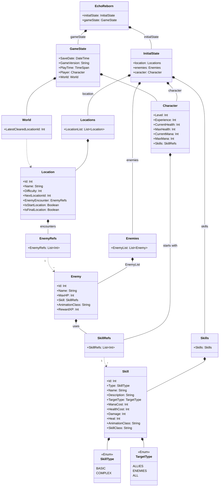

# XML Structures

```mermaid
classDiagram
    class EchoReborn {
        +initialState: InitialState
        +gameState: GameState
    }

    class InitialState {
        +location: Locations
        +enemies: Enemies
        +caracter: Character
    }

    class Skill {
        +Id: Int
        +Type: SkillType
        +Name: String
        +Description: String
        +TargetType: TargetType

        +ManaCost: Int
        +HealthCost: Int
        +Damage: Int
        +Heal: Int
        +AnimationClass: String

        +SkillClass: String
        
    }

    class TargetType {
        <<Enum>>
        ALLIES
        ENEMIES
        ALL
    }

    class SkillType {
        <<Enum>>
        BASIC
        COMPLEX
    }

    Skill *-- SkillType
    Skill *-- TargetType

    class Skills {
        +Skills: Skills
    }

    class SkillRefs {
        +SkillRefs: List~Int~
    }

    class Locations {
        +LocationList: List~Location~
    }

    class Location {
        +Id: Int
        +Name: String
        +Difficulty: Int
        +NextLocationId: Int
        +EnemyEncounter: EnemyRefs
        +IsStartLocation: Boolean
        +IsFinalLocation: Boolean
    }

    class Enemies {
        +EnemyList: List~Enemy~
    }

    class Enemy {
        +Id: Int
        +Name: String
        +MaxHP: Int
        +Skill: SkillRefs
        +AnimationClass: String
        +RewardXP: Int
    }

    class EnemyRefs {
        +EnemyRefs: List~Int~
    }

    class GameState {
        +SaveDate: DateTime
        +GameVersion: String
        +PlayTime: TimeSpan
        +Player: Character
        +World: World
    }

    class Character {
        +Level: Int
        +Experience: Int
        +CurrentHealth: Int
        +MaxHealth: Int
        +CurrentMana: Int
        +MaxMana: Int
        +Skills: SkillRefs
    }

    class World {
        +LatestClearedLocationId: Int
    }

    EchoReborn *-- InitialState : initialState
    EchoReborn *-- GameState : gameState
    GameState *-- Character
    GameState *-- World

    InitialState *-- Skills : skills
    InitialState *-- Locations : location
    InitialState *-- Enemies : enemies
    InitialState *-- Character : character

    World ..> Location
    EnemyRefs "1" ..> "*" Enemy
    SkillRefs "1" ..> "*" Skill

    Locations *-- Location
    Enemies *-- Enemy : EnemyList
    Enemy *-- SkillRefs : uses
    Skills *-- Skill
    Character *-- SkillRefs : starts with
    Location *-- EnemyRefs : encounters

  
```
