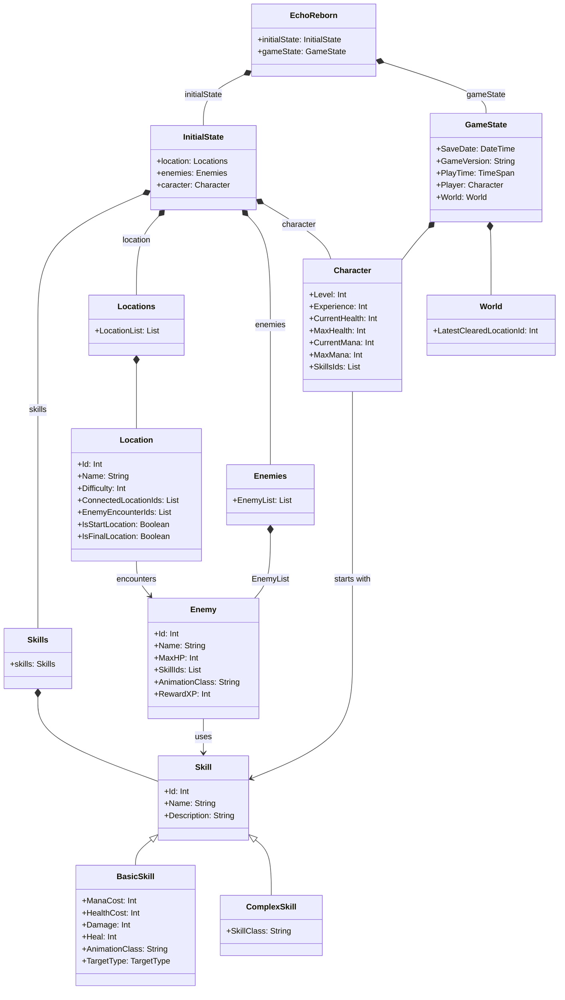

# XML Structures

```mermaid
classDiagram
    class EchoReborn {
        +initialState: InitialState
        +gameState: GameState
    }

    class InitialState {
        +location: Locations
        +enemies: Enemies
        +caracter: Character
    }

    class Skill {
        +Id: Int
        +Name: String
        +Description: String
    }

    class Skills {
        +skills: Skills
    }

    class BasicSkill {
        +ManaCost: Int
        +HealthCost: Int
        +Damage: Int
        +Heal: Int
        +AnimationClass: String
        +TargetType: TargetType
    }

    class ComplexSkill {
        +SkillClass: String
    }

    class Locations {
        +LocationList: List<Location>
    }

    class Location {
        +Id: Int
        +Name: String
        +Difficulty: Int
        +ConnectedLocationIds: List<Int>
        +EnemyEncounterIds: List<Int>
        +IsStartLocation: Boolean
        +IsFinalLocation: Boolean
    }

    class Enemies {
        +EnemyList: List<Enemy>
    }

    class Enemy {
        +Id: Int
        +Name: String
        +MaxHP: Int
        +SkillIds: List<Int>
        +AnimationClass: String
        +RewardXP: Int
    }

    class GameState {
        +SaveDate: DateTime
        +GameVersion: String
        +PlayTime: TimeSpan
        +Player: Character
        +World: World
    }

    class Character {
        +Level: Int
        +Experience: Int
        +CurrentHealth: Int
        +MaxHealth: Int
        +CurrentMana: Int
        +MaxMana: Int
        +SkillsIds: List<Int>
    }

    class World {
        +LatestClearedLocationId: Int
    }

    EchoReborn *-- InitialState : initialState
    EchoReborn *-- GameState : gameState
    GameState *-- Character
    GameState *-- World

    InitialState *-- Skills : skills
    InitialState *-- Locations : location
    InitialState *-- Enemies : enemies
    InitialState *-- Character : character

    Skill <|-- BasicSkill
    Skill <|-- ComplexSkill

    Locations *-- Location
    Enemies *-- Enemy : EnemyList
    Enemy --> Skill : uses
    Skills *-- Skill
    Character --> Skill : starts with
    Location --> Enemy : encounters

```
