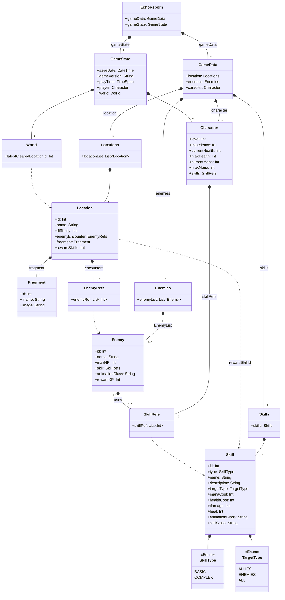

# XML Structures

```mermaid
classDiagram
    class EchoReborn {
        +gameData: GameData
        +gameState: GameState
    }

    class GameData {
        +location: Locations
        +enemies: Enemies
        +caracter: Character
    }

    class Skill {
        +id: Int
        +type: SkillType
        +name: String
        +description: String
        +targetType: TargetType

        +manaCost: Int
        +healthCost: Int
        +damage: Int
        +heal: Int
        +animationClass: String

        +skillClass: String
        
    }

    class TargetType {
        <<Enum>>
        ALLIES
        ENEMIES
        ALL
    }

    class SkillType {
        <<Enum>>
        BASIC
        COMPLEX
    }

    Skill *-- SkillType
    Skill *-- TargetType

    class Skills {
        +skills: Skills
    }

    class SkillRefs {
        +skillRef: List~Int~
    }

    class Locations {
        +locationList: List~Location~
    }

    class Location {
        +id: Int
        +name: String
        +difficulty: Int
        +enemyEncounter: EnemyRefs
        +fragment: Fragment
        +rewardSkillId: Int
    }
    class Fragment {
        +id: Int
        +mame: String
        +image: String
    }

    class Enemies {
        +enemyList: List~Enemy~
    }

    class Enemy {
        +id: Int
        +name: String
        +maxHP: Int
        +skill: SkillRefs
        +animationClass: String
        +rewardXP: Int
    }

    class EnemyRefs {
        +enemyRef: List~Int~
    }

    class GameState {
        +saveDate: DateTime
        +gameVersion: String
        +playTime: TimeSpan
        +player: Character
        +world: World
    }

    class Character {
        +level: Int
        +experience: Int
        +currentHealth: Int
        +maxHealth: Int
        +currentMana: Int
        +maxMana: Int
        +skills: SkillRefs
    }

    class World {
        +latestClearedLocationId: Int
    }

    EchoReborn *-- "1" GameData : gameData
    EchoReborn *-- "1" GameState : gameState
    GameState *-- "1" Character
    GameState *-- "1" World

    GameData *-- "1"Skills : skills
    GameData *--"1"Locations : location
    GameData *--"1" Enemies : enemies
    GameData *--"1" Character : character

    World ..> Location
    EnemyRefs  ..>  Enemy
    SkillRefs  ..>  Skill
    Location  ..>  Skill : rewardSkillId

    Locations *-- "5"Location
    Enemies *-- "1..*"Enemy : EnemyList
    Enemy "1..*"*-- "1..*"SkillRefs : uses
    Skills *-- "1..*"Skill
    Character *-- "1" SkillRefs : skillRefs
    Location *-- "1..*"EnemyRefs : encounters
    Location *-- "1" Fragment : fragment

  
```
