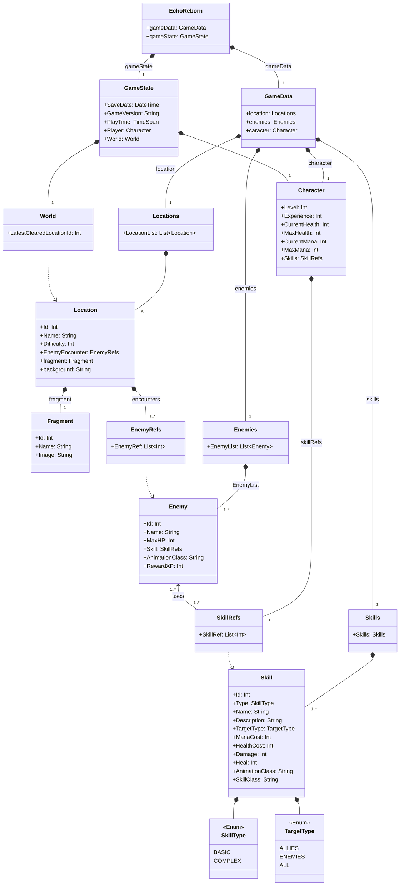

# XML Structures

```mermaid
classDiagram
    class EchoReborn {
        +gameData: GameData
        +gameState: GameState
    }

    class GameData {
        +location: Locations
        +enemies: Enemies
        +caracter: Character
    }

    class Skill {
        +Id: Int
        +Type: SkillType
        +Name: String
        +Description: String
        +TargetType: TargetType

        +ManaCost: Int
        +HealthCost: Int
        +Damage: Int
        +Heal: Int
        +AnimationClass: String

        +SkillClass: String
        
    }

    class TargetType {
        <<Enum>>
        ALLIES
        ENEMIES
        ALL
    }

    class SkillType {
        <<Enum>>
        BASIC
        COMPLEX
    }

    Skill *-- SkillType
    Skill *-- TargetType

    class Skills {
        +Skills: Skills
    }

    class SkillRefs {
        +SkillRef: List~Int~
    }

    class Locations {
        +LocationList: List~Location~
    }

    class Location {
        +Id: Int
        +Name: String
        +Difficulty: Int
        +EnemyEncounter: EnemyRefs
        +fragment: Fragment
        +background: String
    }
    class Fragment {
        +Id: Int
        +Name: String
        +Image: String
    }

    class Enemies {
        +EnemyList: List~Enemy~
    }

    class Enemy {
        +Id: Int
        +Name: String
        +MaxHP: Int
        +Skill: SkillRefs
        +AnimationClass: String
        +RewardXP: Int
    }

    class EnemyRefs {
        +EnemyRef: List~Int~
    }

    class GameState {
        +SaveDate: DateTime
        +GameVersion: String
        +PlayTime: TimeSpan
        +Player: Character
        +World: World
    }

    class Character {
        +Level: Int
        +Experience: Int
        +CurrentHealth: Int
        +MaxHealth: Int
        +CurrentMana: Int
        +MaxMana: Int
        +Skills: SkillRefs
    }

    class World {
        +LatestClearedLocationId: Int
    }

    EchoReborn *-- "1" GameData : gameData
    EchoReborn *-- "1" GameState : gameState
    GameState *-- "1" Character
    GameState *-- "1" World

    GameData *-- "1"Skills : skills
    GameData *--"1"Locations : location
    GameData *--"1" Enemies : enemies
    GameData *--"1" Character : character

    World ..> Location
    EnemyRefs  ..>  Enemy
    SkillRefs  ..>  Skill

    Locations *-- "5"Location
    Enemies *-- "1..*"Enemy : EnemyList
    Enemy "1..*"<-- "1..*"SkillRefs : uses
    Skills *-- "1..*"Skill
    Character *-- "1" SkillRefs : skillRefs
    Location *-- "1..*"EnemyRefs : encounters
    Location *-- "1" Fragment : fragment

  
```
